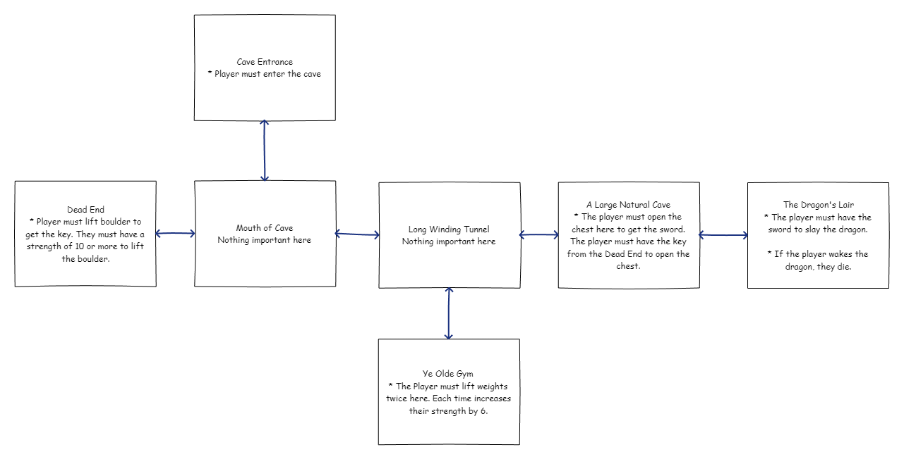
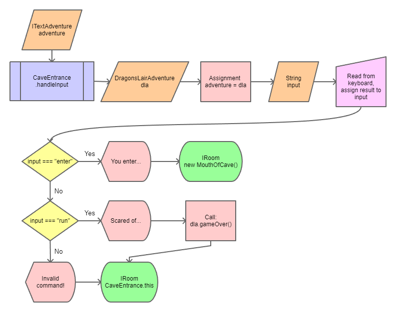
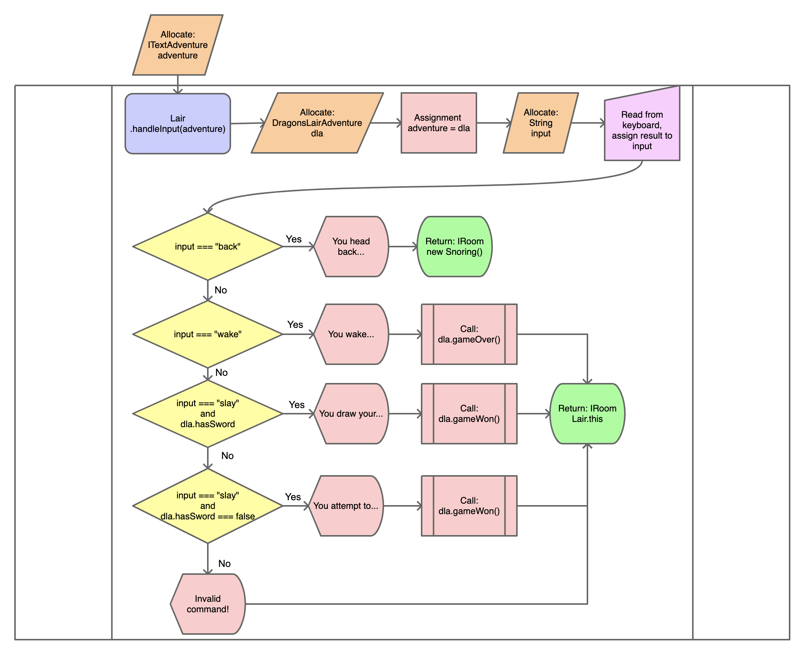
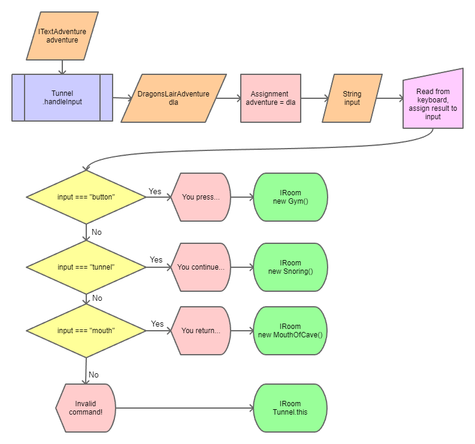

# The Dragon's Lair

The Dragon's Lair is an adventure into a slumbering dragon's cave.

- [The Dragon's Lair](#the-dragons-lair)
  - [Variables](#variables)
  - [Map](#map)
  - [Rooms](#rooms)
    - [Cave Entrance](#cave-entrance)
      - [Valid Commands](#valid-commands)
      - [Flowchart](#flowchart)
      - [handleInput method](#handleinput-method)
    - [Dead End](#dead-end)
      - [Valid Commands](#valid-commands-1)
      - [Flowchart](#flowchart-1)
      - [handleInput method](#handleinput-method-1)
    - [Ye Olde Gym](#ye-olde-gym)
      - [Valid Commands](#valid-commands-2)
      - [Flowchart](#flowchart-2)
      - [handleInput method](#handleinput-method-2)
    - [The Dragon's Lair](#the-dragons-lair-1)
      - [Valid Commands](#valid-commands-3)
      - [Flowchart](#flowchart-3)
      - [handleInput method](#handleinput-method-3)
    - [Mouth of Cave](#mouth-of-cave)
      - [Valid Commands](#valid-commands-4)
      - [Flowchart](#flowchart-4)
      - [handleInput method](#handleinput-method-4)
    - [A Large Natural Cave](#a-large-natural-cave)
      - [Valid Commands](#valid-commands-5)
      - [Flowchart](#flowchart-5)
      - [handleInput method](#handleinput-method-5)
    - [A Long Winding Tunnel](#a-long-winding-tunnel)
      - [Valid Commands](#valid-commands-6)
      - [Flowchart](#flowchart-6)
      - [handleInput method](#handleinput-method-6)

## Variables

The Dragons Lair adventure has 3 variables:

* FlamingGoatAdventure.isGoatOnFire - This is a boolean which tracks if the Goat
  is currently on fire
* FlamingGoatAdventure.hasSpryte - This is a boolean which tracks if the player
  has a Spryte

* DragonsLair.hasKey - This is a boolean which tracks if the player has found the key
* DragonsLair.hasSword - This is a boolean which tracks if the player has found the sword
* DragonsLair.strength - This is a number which tracks how strong the player is

## Map



## Rooms

There are 7 rooms in the Dragon's Lair Adventure

### Cave Entrance

This is the entrance to the cave. The player must choose to enter the cave or
run home.

#### Valid Commands

* enter
* run

#### Flowchart



#### handleInput method

```typescript
async handleInput(adventure: ITextAdventure): Promise<IRoom> {
        const dla: DragonsLairAdventure = adventure as DragonsLairAdventure;
        const input: string = (await dla.getInput()).toLowerCase().trim();

        if (input === "enter") {
            dla.print("You enter the cave.\n");
            return new MouthOfCave();
        }
        else if (input === "run") {
            dla.print("Scared of the dragon, you run home to your bed where fall asleep.\n");
            dla.gameOver();
        }
        else {
            dla.print("Invalid command!");
        }
        return this;
    }
```

### Dead End

This is a dead end within the cave. There is a boulder here with a key under it.
The player must be strong enough to pick up the boulder (strength >= 10). The
key opens the chest in the tunnel.

#### Valid Commands

* boulder
* back

#### Flowchart

TODO: Complete this section for Milestone 1

#### handleInput method

```typescript
async handleInput(adventure: ITextAdventure): Promise<IRoom> {
    // Convert the adventure to a DragonsLairAdventure so you can access the 
    // DragonsLairAdventure variables.
    const dla: DragonsLairAdventure = adventure as DragonsLairAdventure;

    // Read input from the user, set it to lowercase, and remove all whitespace
    const input: string = (await dla.getInput()).toLowerCase().trim();

    // Check to see if the user typed a valid command
    if (input === "boulder" && dla.strength < 10) {
        dla.print("You try to lift the boulder but you're too weak!\n");
    }
    else if (input === "boulder" && dla.strength >= 10) {
        dla.print("You lift the boulder with ease!\n");
        if (dla.hasKey) {
            dla.print("Now you're just showing off.\n");
        }
        else {
            dla.print("Beneath the boulder, you find a key.\n");
            dla.print("You take the key and place it in your pocket!\n");
            dla.hasKey = true;
        }

    }
    else if (input === "back") {
        dla.print("You return to the Mouth of the Cave\n");
        return new MouthOfCave();
    }
    else {
        dla.print("Invalid command!\n");
    }
    return this;
}
```

### Ye Olde Gym

The cave has a gym hidden deep inside. The player can lift weights here to
increase their strength.

#### Valid Commands

* weights
* elevator

#### Flowchart

TODO: Complete this section for Milestone 1

#### handleInput method

```typescript
async handleInput(adventure: ITextAdventure): Promise<IRoom> {
    // Convert the adventure to a DragonsLairAdventure so you can access the 
    // DragonsLairAdventure variables.
    const dla: DragonsLairAdventure = adventure as DragonsLairAdventure;

    // Read input from the user, set it to lowercase, and remove all whitespace
    const input: string = (await dla.getInput()).toLowerCase().trim();

    // Check to see if the user typed a valid command
    if (input === "weights" && dla.strength < 10) {
        dla.print("You pick up the weights and do a rep!\n");
        dla.strength = dla.strength + 6;
        dla.sleep(1);
        dla.print(`Your strength is now ${dla.strength}\n`);
    }
    else if (input === "weights" && dla.strength >= 10) {
        dla.print("You're feeling pretty strong already, maybe you could go lift some boulders!\n");
    }
    else if (input === "elevator") {
        dla.print("You enter the elevator and begin to ascend.");
        dla.sleep(1);
        dla.print(".");
        dla.sleep(1);
        dla.print(".\n");
        dla.sleep(1);
        dla.print("The door opens and you step out into the cave.\n");
        return new Tunnel();
    }
    else {
        dla.print("Invalid command!\n");
    }
    return this;
}
```

### The Dragon's Lair

This is where the Dragon is sleeping. If the player wakes the dragon or attempts
to slay it without a sword, they will be eaten.

#### Valid Commands

* back
* wake
* slay

#### Flowchart



#### handleInput method

```typescript
async handleInput(adventure: ITextAdventure): Promise<IRoom> {
    const dla: DragonsLairAdventure = adventure as DragonsLairAdventure;
    const input: string = (await dla.getInput()).toLowerCase().trim();
    if (input === "back")
        {
            dla.print("You head back the way you came.\n");
            return new Snoring();
        }
        else if (input === "wake")
        {
            dla.print("You wake the dragon...\n");
            dla.sleep(1);
            dla.print(`The dragon wakes and snarls, 'Who disturbs my slumber!?' It glares at you with
disdain and smiles crookedly before devouring you. The dragon lets out a
satisfying belch before closing its eyes and drifting back to sleep.`);
            dla.gameOver();
        }
        else if (input === "slay" && dla.hasSword)
        {
            dla.print("You draw your sword to slay the dragon.\n");
            dla.sleep(1);
            dla.print(`With your sword in hand, you sneak up to the dragon and drive it into the
beast's heart. The evil dragon winces as it realizes its reign of terror is
over. Congratulations, you are a hero!`);
            dla.gameWon();
        }
        else if (input === "slay" && !dla.hasSword)
        {
            dla.print("You attempt to pummel the dragon with your fists!\n");
            dla.sleep(1);
            dla.print(`The dragon wakes and snarls, 'Who disturbs my slumber!?' It glares at you with
disdain and smiles crookedly before devouring you. The dragon lets out a
satisfying belch before closing its eyes and drifting back to sleep.`);
            dla.gameOver();
        }
        else
        {
            dla.print("Invalid command!\n");
        }
    return this;
}
```

### Mouth of Cave

This is the second room in the adventure. The cave forks in two directions.

#### Valid Commands

* left
* right
* entrance

#### Flowchart

TODO: Complete this section for Milestone 1

#### handleInput method

```typescript
    async handleInput(adventure: ITextAdventure): Promise<IRoom> {
        // Convert the adventure to a DragonsLairAdventure so you can access the 
        // DragonsLairAdventure variables.
        const dla: DragonsLairAdventure = adventure as DragonsLairAdventure;

        // Read input from the user, set it to lowercase, and remove all whitespace
        const input: string = (await dla.getInput()).toLowerCase().trim();

        // Check to see if the user typed a valid command
        if (input === "right")
            {
                dla.print("You take the path to the right.\n");
                return new Tunnel();
            }
            else if (input === "left")
            {
                dla.print("You take the path to the left.\n");
                return new DeadEnd();
            }
            else if (input === "entrance")
            {
                dla.print("On second thought, you return to the entrance.\n");
                return new CaveEntrance();
            }
            else
            {
                dla.print("Invalid Command!\n");
            }
        return this;
    }
```

### A Large Natural Cave

The cave opens up into a large natural cave with a chest in it. The chest
contains a sword. A key is required to open the chest.

#### Valid Commands

* snoring
* chest
* tunnel

#### Flowchart

TODO: Complete this section for Milestone 1

#### handleInput method

```typescript
async handleInput(adventure: ITextAdventure): Promise<IRoom> {
    // Convert the adventure to a DragonsLairAdventure so you can access the 
    // DragonsLairAdventure variables.
    const dla: DragonsLairAdventure = adventure as DragonsLairAdventure;

    // Read input from the user, set it to lowercase, and remove all whitespace
    const input: string = (await dla.getInput()).toLowerCase().trim();

    // Check to see if the user typed a valid command
    if (input === "snoring") {
        dla.print("You slowly approach the snoring...\n");
        return new Lair();
    }
    else if (input === "chest" && dla.hasKey) {

        if (dla.hasSword === false) {
            dla.print("The chest is locked.\n");
            dla.sleep(1);
            dla.print("You take the key from your pocket and unlock the chest.\n");
            dla.sleep(1);
            dla.print("Inside, you find a beautiful sword!\n");
            dla.hasSword = true;
        }
        else {
            dla.print("You search the chest again, but it is empty.\n");
        }

    }
    else if (input === "chest" && !dla.hasKey) {
        dla.print("The chest is locked!\n");
    }
    else if (input === "tunnel") {
        dla.print("You head back toward the mouth of the cave.\n");
        return new Tunnel();
    }
    else {
        dla.print("Invalid command!\n");
    }
    return this;
}
```

### A Long Winding Tunnel

This is a long tunnel leading toward the dragon's lair. There is a button here
that leads to the gym.

#### Valid Commands

* button
* mouth
* tunnel

#### Flowchart



#### handleInput method

```typescript
async handleInput(adventure: ITextAdventure): Promise<IRoom> {
        const dla: DragonsLairAdventure = adventure as DragonsLairAdventure;
        const input: string = (await dla.getInput()).toLowerCase().trim();
        if (input === "button")
            {
                dla.print("You press the button and wait.");
                dla.sleep(1);
                dla.print(".");
                dla.sleep(1);
                dla.print(".\n");
                dla.sleep(1);
                dla.print("DING! The wall next to the button opens revealing an elevator!\n");
                dla.print("Entering the elevator, you begin to descend.");
                dla.sleep(1);
                dla.print(".");
                dla.sleep(1);
                dla.print(".\n");
                dla.sleep(1);
                dla.print("The elevator door opens and you exit.\n");
                return new Gym();
            }
            else if (input === "tunnel")
            {
                dla.print("You continue down the tunnel.\n");
                return new Snoring();
            }
            else if (input === "mouth")
            {
                dla.print("You return to the mouth of the cave.\n");
                return new MouthOfCave();
            }
            else
            {
                adventure.print("Invalid command!\n");
            }
        return this;
    }
```