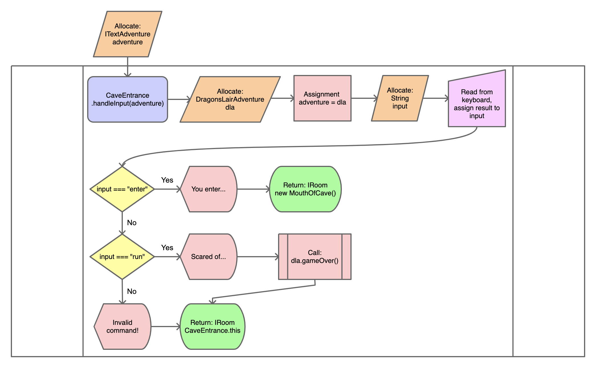
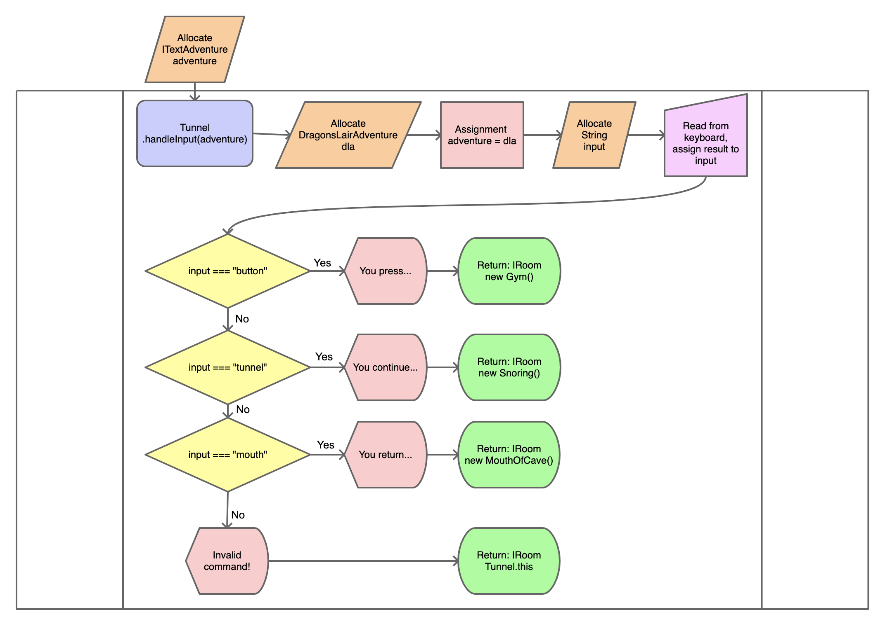

# The Dragon's Lair

## Flowcharts

### Cave Entrance

```typescript
async handleInput(adventure: ITextAdventure): Promise<IRoom> {
        const dla: DragonsLairAdventure = adventure as DragonsLairAdventure;
        const input: string = (await dla.getInput()).toLowerCase().trim();

        if (input === "enter") {
            dla.print("You enter the cave.\n");
            return new MouthOfCave();
        }
        else if (input === "run") {
            dla.print("Scared of the dragon, you run home to your bed where fall asleep.\n");
            dla.gameOver();
        }
        else {
            dla.print("Invalid command!");
        }
        return this;
    }
```



### Dead End

TODO

### Gym

TODO

### Lair

```typescript
    async handleInput(adventure: ITextAdventure): Promise<IRoom> {
        const dla: DragonsLairAdventure = adventure as DragonsLairAdventure;
        const input: string = (await dla.getInput()).toLowerCase().trim();
        if (input === "back")
            {
                dla.print("You head back the way you came.\n");
                return new Snoring();
            }
            else if (input === "wake")
            {
                dla.print("You wake the dragon...\n");
                dla.sleep(1);
                dla.print(`The dragon wakes and snarls, 'Who disturbs my slumber!?' It glares at you with
disdain and smiles crookedly before devouring you. The dragon lets out a
satisfying belch before closing its eyes and drifting back to sleep.`);
                dla.gameOver();
            }
            else if (input === "slay" && dla.hasSword)
            {
                dla.print("You draw your sword to slay the dragon.\n");
                dla.sleep(1);
                dla.print(`With your sword in hand, you sneak up to the dragon and drive it into the
beast's heart. The evil dragon winces as it realizes its reign of terror is
over. Congratulations, you are a hero!`);
                dla.gameWon();
            }
            else if (input === "slay" && !dla.hasSword)
            {
                dla.print("You attempt to pummel the dragon with your fists!\n");
                dla.sleep(1);
                dla.print(`The dragon wakes and snarls, 'Who disturbs my slumber!?' It glares at you with
disdain and smiles crookedly before devouring you. The dragon lets out a
satisfying belch before closing its eyes and drifting back to sleep.`);
                dla.gameOver();
            }
            else
            {
                dla.print("Invalid command!\n");
            }
        return this;
    }
```


### Mouth of Cave

TODO

### Snoring

TODO

### Tunnel

```typescript
async handleInput(adventure: ITextAdventure): Promise<IRoom> {
        const dla: DragonsLairAdventure = adventure as DragonsLairAdventure;
        const input: string = (await dla.getInput()).toLowerCase().trim();
        if (input === "button")
            {
                dla.print("You press the button and wait.");
                dla.sleep(1);
                dla.print(".");
                dla.sleep(1);
                dla.print(".\n");
                dla.sleep(1);
                dla.print("DING! The wall next to the button opens revealing an elevator!\n");
                dla.print("Entering the elevator, you begin to descend.");
                dla.sleep(1);
                dla.print(".");
                dla.sleep(1);
                dla.print(".\n");
                dla.sleep(1);
                dla.print("The elevator door opens and you exit.\n");
                return new Gym();
            }
            else if (input === "tunnel")
            {
                dla.print("You continue down the tunnel.\n");
                return new Snoring();
            }
            else if (input === "mouth")
            {
                dla.print("You return to the mouth of the cave.\n");
                return new MouthOfCave();
            }
            else
            {
                adventure.print("Invalid command!\n");
            }
        return this;
    }
```



