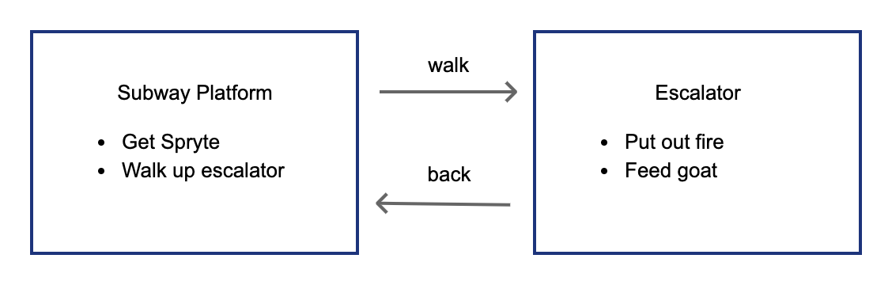
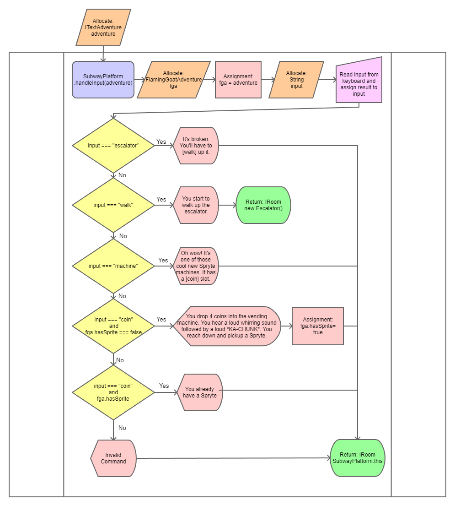
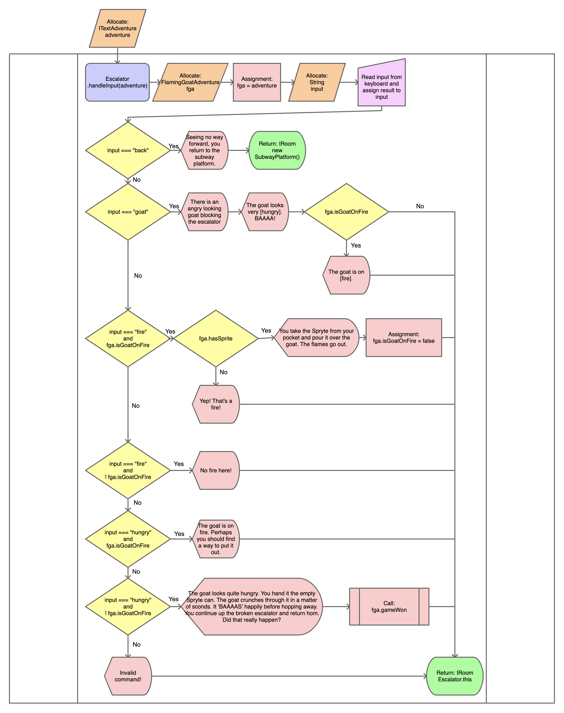

# Flaming Goat

The Flaming Goat is a text adventure in which the player must find their way out
of the subway.

## Variables

The Flaming Goat adventure has 2 variables:

* FlamingGoatAdventure.isGoatOnFire - This is a boolean which tracks if the Goat
  is currently on fire
* FlamingGoatAdventure.hasSpryte - This is a boolean which tracks if the player
  has a Spryte

## Map



### Rooms

There are 2 rooms in the Flaming Goat adventure.

#### SubwayPlatform

The player begins their adventure here. This is a Subway Platform which has a
broken escalator and a vending machine. The player must use the vending machine
to get a Spryte. This is controlled using the `hasSpryte` variable.

##### Valid Commands

* escalator
* walk
* coin
* machine

##### Flowchart



##### handleInput code

```typescript
//TODO: Complete code block
```

#### Escalator

The player can walk up the escalator but it is blocked by a goat which is on
fire. The player must put the fire out and feed it a Spryte can to exit the
subway.

##### Valid Commands

* goat
* back
* fire
* hungry

##### Flowchart

```typescript
//TODO: Complete code block
```




##### handleInput code

```typescript
//TODO: Complete code block
```

