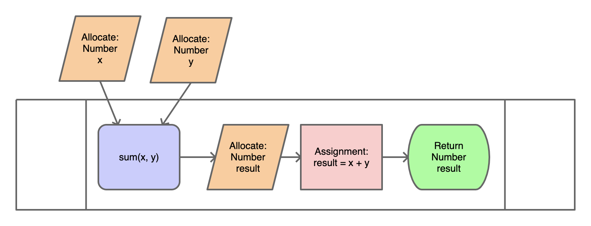

# AdventureQuest

A text based adventure engine.

## Table of Contents

- [AdventureQuest](#adventurequest)
  - [Table of Contents](#table-of-contents)
  - [Overview](#overview)
  - [The Dragon's Lair](#the-dragons-lair)
  - [Getting Started](#getting-started)
    - [Sign up for the project](#sign-up-for-the-project)
    - [Clone your repository](#clone-your-repository)
    - [Setting up the project](#setting-up-the-project)
      - [Install Node Version Manager](#install-node-version-manager)
        - [Mac OS](#mac-os)
        - [Windows](#windows)
      - [Initializing the Project](#initializing-the-project)
      - [Running the Project](#running-the-project)
        - [Angular](#angular)
        - [Creating a Server](#creating-a-server)
  - [Milestone 1](#milestone-1)
    - [Task List](#task-list)
    - [Flow Charts](#flow-charts)
      - [Completed Rooms](#completed-rooms)
      - [Rooms to Complete](#rooms-to-complete)
    - [Milestone 1 Deliverables](#milestone-1-deliverables)
  - [Milestone 2](#milestone-2)
    - [Task List](#task-list-1)
    - [Flaming Goat Adventure](#flaming-goat-adventure)
      - [Implement the Subway Platform Room](#implement-the-subway-platform-room)
        - [Getting Started](#getting-started-1)
        - [My first if statement](#my-first-if-statement)
        - [Breaking down an if statement](#breaking-down-an-if-statement)
        - [My First else if statement](#my-first-else-if-statement)
        - [Breaking down an else if statement](#breaking-down-an-else-if-statement)
        - [My first else statement](#my-first-else-statement)
        - [Breaking down an else statement](#breaking-down-an-else-statement)
        - [Finishing the Subway Platform Room](#finishing-the-subway-platform-room)
      - [Implement the Escalator Room](#implement-the-escalator-room)
    - [Milestone 2 Deliverables](#milestone-2-deliverables)
  - [Milestone 3](#milestone-3)
    - [Task List](#task-list-2)
    - [Design Document](#design-document)
    - [Milestone 3 Deliverables](#milestone-3-deliverables)
  - [Milestone 4](#milestone-4)
    - [Task List](#task-list-3)
    - [Create a Text Adventure](#create-a-text-adventure)
    - [Milestone 4 Deliverables](#milestone-4-deliverables)
  - [Grading](#grading)
    - [Computational Thinking](#computational-thinking)
    - [Computing, Programming, and Practice](#computing-programming-and-practice)
    - [Skills of a Programmer](#skills-of-a-programmer)
  - [Getting Help](#getting-help)
  - [Appendix A: Flow Chart Components](#appendix-a-flow-chart-components)
    - [Entry Point](#entry-point)
    - [Procedure](#procedure)
      - [Calling a Procedure](#calling-a-procedure)
    - [Process](#process)
    - [Display](#display)
    - [User Input](#user-input)
    - [Data](#data)
      - [Accessing Data](#accessing-data)
    - [Decision](#decision)
    - [Connector](#connector)
    - [Terminal](#terminal)
  - [Appendix B: Keywords](#appendix-b-keywords)
    - [Sequence](#sequence)
    - [Selection](#selection)
    - [Iteration](#iteration)
  - [Appendix C: README.md](#appendix-c-readmemd)
    - [Headers](#headers)
- [Header 1](#header-1)
  - [Header 2](#header-2)
    - [Header 3](#header-3)
    - [Code Boxes](#code-boxes)
    - [Images](#images)

## Overview

You will design a text based adventure game and implement it in the Adventure
Quest Game Engine where it can be played by anyone in the world!

## The Dragon's Lair

The Dragon's Lair is a text adventure created by Mx. Collard to demonstrate the
Adventure Quest Game Engine's API (Application Programming Interface). The API
defines a protocol that if followed, allows for a text adventure to be created
by defining the rooms that comprise the adventure. For the first Milestone of
this project, you will study the code of this text adventure.

Play The Dragon's Lair:
[LINK](https://chadwickcsp.github.io/AdventureQuest/DragonsLair/)

Source Code:

* [project/src/adventure/DragonsLair/](project/src/adventure/DragonsLair/)
    * [DragonsLair.ts](project/src/adventure/DragonsLair/DragonsLair.ts)
    * [rooms/](project/src/adventure/DragonsLair/rooms/)
        * [CaveEntrance.ts](project/src/adventure/DragonsLair/rooms/CaveEntrance.ts)
        * [DeadEnd.ts](project/src/adventure/DragonsLair/rooms/DeadEnd.ts)
        * [Gym.ts](project/src/adventure/DragonsLair/rooms/Gym.ts)
        * [Lair.ts](project/src/adventure/DragonsLair/rooms/Lair.ts)
        * [MouthOfCave.ts](project/src/adventure/DragonsLair/rooms/MouthOfCave.ts)
        * [Snoring.ts](project/src/adventure/DragonsLair/rooms/Snoring.ts)
        * [Tunnel.ts](project/src/adventure/DragonsLair/rooms/Tunnel.ts)

## Getting Started

### Sign up for the project

Sign up for the project here: [LINK](https://classroom.github.com/a/ycut8oRc)

### Clone your repository

After you have signed up for the project, you can clone it using GitHub Desktop.


1. Click the Current Repository drop down


2. Click `Add` > `Clone Repository`


3. Select the `GitHub.com` tab


4. Select the `adventure-quest-XXXXXX` repository and click clone. You may have
   to click the refresh icon next to `Filter your repositores` before it will be
   displayed.

5. Open the project in `Visual Studio Code`

### Setting up the project

#### Install Node Version Manager

##### Mac OS

The easiest way to install Node Version Manager is to first install Homebrew.
Homebrew is a package manager for Mac OS that makes it easy for users to install
libraries and software all in one place.

To install Homebrew:

1. Open a terminal. 
    * If you press (Command + Space) you will open Searchlight Finder.
    * Type "Terminal" and press enter
2. Run this command: 
    * `/bin/bash -c "$(curl -fsSL
      https://raw.githubusercontent.com/Homebrew/install/HEAD/install.sh)"`
3. Follow the on screen instruction. When you're prompted for a password, type
   the password you use to log into your computer. Installation may take some
   time.
4. After the installation is complete, you will likely see a message saying
   there are 2 more commands you must run. Copy and paste those commands into
   your terminal one at a time.

After Homebrew is installed, you can install Node Version Manager by running the
following commands:

1. Download [install-nvm.command.zip](support/install-nvm.command.zip?raw=true)
2. Unzip the file
3. In your terminal type `bash` (don't press enter) 
4. Drag and drop the `install-nvm.command` file into the terminal
5. Press enter
6. You should see the installation running.
7. When completed, you need to reopen your terminal. Close your terminal window, and open a new one.

To verify that Node Version Manager is installed, run the following command:

`nvm --version`

You should see something like:

`0.38.0`

##### Windows

To get Node Version Manager, download `nvm-setup.zip` from this page:
[LINK](https://github.com/coreybutler/nvm-windows/releases/tag/1.1.7)

Unzip the file and run the installer.

To verify that Node Version Manager is installed:

1. Open a Terminal
    * Press the Windows Key
    * Type `Git Bash` and press enter
2. In the terminal window type `nvm version`

If it is installed, you should see something like:

`1.1.7`

#### Initializing the Project

Next, we will initialize the project, downloading all the necessary dependencies
and running it locally on your computer.

1. First, open your project in Visual Studio Code
2. Press (Command + Shift + P) to see the Command Palette
3. Search for `Terminal: Select Default Profile`
    * On Mac, select `bash`
    * On Windows, Select `Git Bash`
4. Press (Command + Shift + P) to open the Command Palette
5. Search for `Create New Terminal`
    * This will open a terminal at the bottom of Visual Studio Code, click into
      it.
6. Run the command `cd project`
    * The `cd` command stands for Change Directory, it will move the terminal to
      be in the `project` folder
7. Run the command `nvm install 16.9.1`
    * This command will download a program called Node which is used to run
      JavaScript
8. Run the command `nvm use 16.9.1`
    * This command tells your terminal to use this version of Node
9. Run the command `npm install`
    * This command will install all of the dependencies to run Adventure Quest.
      This command will take several minutes to run.

If all goes well, you're ready to run the project!

#### Running the Project

##### Angular

This project uses a framework called Angular.

Angular is a popular open-source web development platform developed and
maintained by Google. Angular provides a suite of tools to help build, test, and
update code. Angular is an industry standard and knowing it is a highly sought
skill. Angular uses the Typescript programming language.

##### Creating a Server

To create a server to run the project:

1. Open a Terminal (if you have not done so already)
    * (Command + Shift + P) -> `Create New Terminal`
2. Make sure you're in the project folder
    * `cd project`
3. Run the command `npx ng serve -o`
    * This command runs Angular, creates a debugging server on your computer,
      and opens your default web browser on the project which is running at
      `localhost:4200`.

## Milestone 1

* **E Period** - Thursday, September 23rd @ 11:59PM
* **C Period** - Friday, September 24th @ 11:59PM

For this milestone, you will study the source code of [The Dragon's
Lair](#the-dragons-lair) adventure. 

For this milestone, you may work in groups of 2 or 3. However, each person is
responsible for producing flowcharts in their own project repository.

### Task List

- [ ] Play The Dragon's Lair
- [ ] Review the Dragon's Lair design document
- [ ] Complete flowchart for Dead End
- [ ] Add flowchart to README.md
- [ ] Complete flowchart for Gym
- [ ] Add flowchart to README.md
- [ ] Complete flowchart for Mouth of Cave
- [ ] Add flowchart to README.md
- [ ] Complete flowchart for Snoring
- [ ] Add flowchart to README.md
- [ ] Commit Work (you should do this each time you finish working)
- [ ] Add `milestone-1` tag
- [ ] Push Work (you should do this each time you finish working)

### Flow Charts

The Dragon's Lair adventure contains 7 rooms. For this milestone, you will study
the code for each of these rooms and translate their `handleInput` methods into
procedure flowcharts. 3 of the rooms have been complete for you. As you complete
each room, you should add its code and flowchart to the README.md file in the
`DragonsLair` folder. For more information on procedure flowcharts, see
[Appendix A: Procedure](#procedure)

**Note**: You should use the correct shapes as defined in [Appendix
A](#appendix-a-flow-chart-components). This is part of the [Computing,
Programming, and Practice](#computing-programming-and-practice) rubric. I
recommend using [Pencil](https://pencil.evolus.vn/) for creating your flow
charts. If you would like to use Mx. Collard's Shape library, you can download
it: [LINK](support/Computer%20Science%20Flowcharts.zip)

#### Completed Rooms
1. [Cave Entrance](project/src/adventure/DragonsLair/rooms/CaveEntrance.ts)
    * [Flowchart](DragonsLair/README.md#cave-entrance)
2. [Lair](project/src/adventure/DragonsLair/rooms/Lair.ts)
    * [Flowchart](DragonsLair/README.md#lair)
3. [Tunnel](project/src/adventure/DragonsLair/rooms/Tunnel.ts)
    * [Flowchart](DragonsLair/README.md#tunnel)

#### Rooms to Complete
1. [Dead End](project/src/adventure/DragonsLair/rooms/DeadEnd.ts)
2. [Gym](project/src/adventure/DragonsLair/rooms/Gym.ts)
3. [Mouth of Cave](project/src/adventure/DragonsLair/rooms/MouthOfCave.ts)
4. [Snoring](project/src/adventure/DragonsLair/rooms/Snoring.ts)

### Milestone 1 Deliverables

To submit Milestone 1, you should complete the Flowcharts section of the
[DragonsLair/README.md](DragonsLair/README.md) document.

When you have completed the Flowcharts section, committed and pushed it, you
will create a tag called `milestone-1`. If you later decide you would like to
change the commit for `milestone-1` you may create additional tags with a
version number. For example, `milestone-1-v2` or `milestone-1-v3`. For final
grading, the `milestone-1` tag with the greatest version number will be used.
After creating your tag, don't forget to push it to GitHub and verify it is
available online.

## Milestone 2

* **E Period** - Wednesday, September 29th @ 11:59PM
* **C Period** - Thursday, September 30th @ 11:59PM

For this milestone, you will finish the implementation of a short 2 room
adventure.

For this milestone, you may work in groups of 2 or 3. However, each person is
responsible for producing a working version of the Flaming Goat in their
repository.

### Task List

- [ ] Play The Flaming Goat Adventure
- [ ] Review the Flaming Goat design document
- [ ] Follow the Subway Platform Tutorial
- [ ] Complete the Subway Platform
- [ ] Add the Subway Platform code to README.md
- [ ] Complete the Escalator
- [ ] Add the Escalator code to the README.md
- [ ] Commit Work (you should do this each time you finish working)
- [ ] Add `milestone-2` tag
- [ ] Push Work (you should do this each time you finish working)

### Flaming Goat Adventure

The Flaming Goat adventure is a short 2 room text adventure which requires
cunning and a keyboard to complete!

Play a completed version of Flaming Goat:
[LINK](https://chadwickcsp.github.io/AdventureQuest/FlamingGoat/)

Flaming Goat Design Document and Flowcharts:
[FlamingGoat/README.md](FlamingGoat/README.md)

#### Implement the Subway Platform Room

In the Flaming Goat adventure, the player starts on the Subway Platform. Your
first task is to implement it to match the flowchart from the [design
document](FlamingGoat/README.md).

You will edit this file:
[project/src/adventure/FlamingGoat/rooms/SubwayPlatform.ts](project/src/adventure/FlamingGoat/rooms/SubwayPlatform.ts)

##### Getting Started

Adventure Quest is initially set to run in `SINGLE_ADVENTURE_MODE` with The
Dragon's Lair adventure set to run. You will first need to update the
[config.ts](project/src/config/config.ts) file to specify that it should run
Flaming Goat when it starts.

To do this, modify the `Config.getAdventure` method.

Original Code:
```typescript
    public getAdventure(): ITextAdventure {
        //TODO: 
        // Comment the line below then...
        return new DragonsLairAdventure();
        // Uncomment the line beneath this to run the FlamingGoatAdventure
        //return new FlamingGoatAdventure();
    }
```

Updated Code:
```typescript
    public getAdventure(): ITextAdventure {
        //TODO: 
        // Comment the line below then...
        // return new DragonsLairAdventure();
        // Uncomment the line beneath this to run the FlamingGoatAdventure
        return new FlamingGoatAdventure();
    }
```

Make sure to save your changes. Then, you need to make sure your project is
running. If you're not sure how to do this, see [Running the
Project](#running-the-project).

If all goes well, you should visit [localhost:4200](http://localhost:4200) in
your web browser and see the following screen:


##### My first if statement

Currently, within the Flaming Goat adventure, you will never be able to leave
the Subway platform. All inputs entered are simply ignored and the room
description will be printed to the screen.

To have the adventure respond to user inputs, you must update the
[SubwayPlatform.handleInput](project/src/adventure/FlamingGoat/rooms/SubwayPlatform.ts)
method.

Update the code to give a response if the user types `escalator`:

Original Code:
```typescript
    async handleInput(adventure: ITextAdventure): Promise<IRoom> {
        const fga: FlamingGoatAdventure = adventure as FlamingGoatAdventure;
        const input: string = (await fga.getInput()).toLowerCase().trim();
        //TODO
        return this;
    }
```

Updated Code:
```typescript
    async handleInput(adventure: ITextAdventure): Promise<IRoom> {
        const fga: FlamingGoatAdventure = adventure as FlamingGoatAdventure;
        const input: string = (await fga.getInput()).toLowerCase().trim();
        //TODO
        if (input === "escalator") {
            fga.print("\nIt's broken. You'll have to [walk] up it.\n");
        }
        return this;
    }
```

If your Angular server is still running in your VS Code Terminal, after you save
you should see output of it compiling. If all went well, you will see the
following:


In your web browser, the adventure should have restarted. If you closed the tab,
you can find it again at [localhost:4200](http://localhost:4200/). 

Test out the `escalator` input. If all went well, you should see the message you
added. **Note**: `\n` is a special instruction which tells the terminal to
create a new line. 

##### Breaking down an if statement

You've written your first if statement. Now, let's break down its components.

```typescript
if ( <conditional-expression> ){
    <body>
}
```

Every if statement is constructed the following way:

1. The keyword `if`
2. A `conditional-expression`
3. A body which executes if the `conditional-expression` evaluates to `true`.

##### My First else if statement

Next, we will add in the code which will execute when a player enters `walk`. To
do this, we will use an `else if` statement.

Original Code:
```typescript
    async handleInput(adventure: ITextAdventure): Promise<IRoom> {
        const fga: FlamingGoatAdventure = adventure as FlamingGoatAdventure;
        const input: string = (await fga.getInput()).toLowerCase().trim();
        //TODO
        if (input === "escalator") {
            fga.print("\nIt's broken. You'll have to [walk] up it.\n");
        }
        return this;
    }
```

Updated Code:
```typescript
    async handleInput(adventure: ITextAdventure): Promise<IRoom> {
        if (input === "escalator") {
            fga.print("\nIt's broken. You'll have to [walk] up it.\n");
        } else if (input === "walk") {
            fga.print("\nYou start to walk up the escalator.\n");
            // Change to the Escalator room
            return new Escalator();
        } 
        return this;
    }
```

After you save your code and the Angular project has built. Test the `walk`
command for your adventure.

If all went well, your player will now be in the Escalator room. We will talk
more about what `return` does in future projects. For now, it is important to
know that this is the procedure for changing rooms within the Adventure Quest
Engine.

##### Breaking down an else if statement

You've written your first else if statement. Now, let's break down its
components.

```typescript
<if-statement | else-if-statement>
else <if-statement>
```

Every if statement is constructed the following way:

1. An entire `if` or `else if` statement precedes an `else if`
2. The keyword `else`
3. An `if` statement

When an `if` statement's conditional is `false`, it will jump to the end of its
body. If the `else if` keywords are present, the `conditional` of that `if` is
then checked. This proceeds until there are no `else` keywords remaining.

##### My first else statement

When the user enters a command that is not valid, we need to inform them that
the command is not valid. To do this, we will add an `else` statement to our
code.

Original Code:
```typescript
    async handleInput(adventure: ITextAdventure): Promise<IRoom> {
        if (input === "escalator") {
            fga.print("\nIt's broken. You'll have to [walk] up it.\n");
        } else if (input === "walk") {
            fga.print("\nYou start to walk up the escalator.\n");
            // Change to the Escalator room
            return new Escalator();
        } 
        return this;
    }
```

Updated Code:
```typescript
    async handleInput(adventure: ITextAdventure): Promise<IRoom> {
        if (input === "escalator") {
            fga.print("\nIt's broken. You'll have to [walk] up it.\n");
        } else if (input === "walk") {
            fga.print("\nYou start to walk up the escalator.\n");
            // Change to the Escalator room
            return new Escalator();
        } else {
            fga.print("\nInvalid command!");
        }
        return this;
    }
```

After you save your code and the Angular project has built. Test your code by
entering a command other than `escalator` or `walk` command for your adventure.

If all went well, you should see the message `Invalid command!`.

##### Breaking down an else statement

You've written your first else statement. Now, let's break down its components.

```typescript
<if-statement | else-if-statement>
else {
    <body>
}
```

Every if statement is constructed the following way:

1. An entire `if` or `else if` statement precedes an `else`
2. The keyword `else`
3. A body of code to execute if all previous `if` `conditinal-expresion`s are
   `false`.

An `else` statement acts as a catch-all section of code to execute when all of
the previous `conditional-expression`s evaluate to `false`. 

##### Finishing the Subway Platform Room

Now it is your turn to complete the Subway Platform Room. A full flowchart for
this room can be found in the Flaming Goat adventure design document:
[FlamingGoat/README.md](FlamingGoat/README.md)

Don't forget to add your completed code to the Design Document when you have
completed the adventure.

#### Implement the Escalator Room

The Escalator Room is also defined in the [design
document](FlamingGoat/README.md). Use the flowchart to complete the Escalator
Room.

You will edit this file:
[project/src/adventure/FlamingGoat/rooms/Escalator.ts](project/src/adventure/FlamingGoat/rooms/Escalator.ts)

Don't forget to add your completed code to the Design Document when you have
completed the adventure.

### Milestone 2 Deliverables

To submit Milestone 2, you should complete your implementation of the Flaming
Goat adventure as well as update the code sections on the design document for
the Flaming Goat: [FlamingGoat/README.md](FlamingGoat/README.md).

When you have finished your implementation and updated the code sections of the
[FlamingGoat/README.md](FlamingGoat/README.md) file, you should commit and push
your work. Then, you will create a tag called `milestone-2`. If you later decide
you would like to change the commit for `milestone-1` you may create additional
tags with a version number. For example, `milestone-2-v2` or `milestone-2-v3`.
For final grading, the `milestone-2` tag with the greatest version number will
be used. After creating your tag, don't forget to push it to GitHub and verify
it is available online.

## Milestone 3

* **E Period** - Monday, October 4th @ 11:59PM
* **C Period** - Tuesday, October 5th @ 11:59PM

For this milestone, you will create a design document for your own text
adventure.

You must complete this milestone individually. You may however talk to your
peers about their projects as well as give and receive help.

### Task List

- [ ] Create a folder for your adventure
- [ ] Create a README.md file for your design document
- [ ] Create a Variables section 
  - [ ] List your variables (5 or more for advanced)
- [ ] Create a Map section
  - [ ] Add an image of your Map
- [ ] Create a Room section
- [ ] Add a section for each room (10 or more for advanced)
  - [ ] Add a description of the room
  - [ ] Add a Valid Commands section
  - [ ] Add a handleInput method section with an empty code block
- [ ] Select the first 3 rooms in your adventure
  - [ ] Create a flowchart
  - [ ] Add an image of your flowchart
- [ ] Commit your work (you should do this each time you finish working)
- [ ] Tag `milestone-3`
- [ ] Push (you should do this each time you finish working)

### Design Document

Create a new folder for your adventure. Create a README.md in that folder. This
will be your design document.

Your design document should include the following:

* A high level description of your adventure
* A map of your adventure describing what needs to be done in each room
* A list of variables necessary for your adventure
    * For advanced, you should include 5 variables
* A description of each Room in your adventure
    * For advanced, you need at least 10 rooms
* A flowchart for at least 3 of your rooms
    * You should try to select your first 3 rooms and create a flowchart for
      each one.

### Milestone 3 Deliverables

To submit Milestone 3, you should complete a design document for your text
adventure. This should be a README.md file within a new folder named after your
adventure.

When you have finished your design document, you should commit and push your
work. Then, you will create a tag called `milestone-3`. If you later decide you
would like to change the commit for `milestone-3` you may create additional tags
with a version number. For example, `milestone-3-v2` or `milestone-3-v3`. For
final grading, the `milestone-3` tag with the greatest version number will be
used. After creating your tag, don't forget to push it to GitHub and verify it
is available online.

## Milestone 4

* **E Period** - Monday, October 11th @ 11:59PM
* **C Period** - Tuesday, October 12th @ 11:59PM

For this milestone, you will implement your text adventure.

You must complete this milestone individually. You may however talk to your
peers about their projects as well as give and receive help.

### Task List

- [ ] Create a folder in [project/src/adventure/](project/src/adventure/) for
  your adventure
- [ ] Create a folder named `rooms` in your adventure folder
- [ ] Study the [FlamingGoat](project/src/adventure/FlamingGoat/s) and
  [DragonsLair](project/src/adventure/DragonsLair/) adventures to understand how
  to add your adventure.
- [ ] Update the [config.ts](project/src/config/config.ts) file to launch your
  adventure
- [ ] Complete each of your rooms
  - [ ] If necessary, create a flowchart to help debug
  - [ ] If necessary, post on piazza
  - [ ] If necessary, ask for help
- [ ] Make sure your member variables are commented (the ones that start with
  public)
- [ ] Have fun!
- [ ] Commit work often
- [ ] Push work after committing
- [ ] Tag `milestone-4`
- [ ] Push tag

### Create a Text Adventure

Study the code from the Dragons Lair and Flaming Goat adventures to create your
own Text Adventure. Ask lots of questions, post on piazza, and have fun!

### Milestone 4 Deliverables

To submit Milestone 4, you should complete your text adventure. This should be
placed within the [project/src/adventure/](project/src/adventure/) folder.

When you have finished your implementation, you should commit and push your
work. Then, you will create a tag called `milestone-4`. If you later decide you
would like to change the commit for `milestone-4` you may create additional tags
with a version number. For example, `milestone-4-v2` or `milestone-4-v3`. For
final grading, the `milestone-4` tag with the greatest version number will be
used. After creating your tag, don't forget to push it to GitHub and verify it
is available online.

## Grading

For this project, you will receive two project grades. One for Milestones 1 and
2 and another for Milestones 3 and 4. You can think of this project as two
related projects.

### Computational Thinking

In this assignment, you will demonstrate your understanding of flow charts,
sequencing, selection, and iteration.

| Advanced                                                               | Proficient                                                                                                         | Basic                                                                                                              | Below Basic                                                                                   |
|------------------------------------------------------------------------|--------------------------------------------------------------------------------------------------------------------|--------------------------------------------------------------------------------------------------------------------|-----------------------------------------------------------------------------------------------|
| Student successfully completes  all 4 flowcharts for the Dragon's Lair | Student attempts to complete all 4 of the flowcharts for the Dragon's Lair adventure and successfully completes 3. | Student attempts to complete all 4 of the flowcharts for the Dragon's Lair adventure and successfully completes 2. | Student does not successfully complete at least 2 flowcharts for the Dragon's Lair adventure. |
| Student successfully implements the  Flaming Goat Adventure            | Student implements a version of the Flaming Goat adventure that is playable and can be won but may contain bugs.   | Student completes the Subway Platform room and attempts to complete the Flaming Goat room                          | Student does not complete the Subway Platform room                                            |
|                                                                        |                                                                                                                    |                                                                                                                    |                                                                                               |
| Student successfully completes 10 or more rooms in their adventure.    | Student successfully completes 8 or more rooms in their adventure.                                                 | Student successfully completes 6 or more rooms in their adventure.                                                 | Student does not successfully complete at least 6 rooms in their adventure.                   |
| Student utilizes 5 or more variables in their adventure.               | Student successfully utilizes 3 or more variables in their adventure.                                              | Student successfully utilizes 2 or more variables in their adventure.                                              | Student does not successfully utilize at least 2 variables in their adventure.                |

### Computing, Programming, and Practice

It is important for other people to be able to understand and follow your work.
In this assignment, you will demonstrate your ability to commit your work to
your repository, write reasonable commit messages, and provide a REAME.md
document describing how your flow diagram relates to your chosen game's
instructions. 

| Advanced                                                                                          | Proficient                                                                                          | Basic                                                                          | Below Basic                                                                                                  |
|---------------------------------------------------------------------------------------------------|-----------------------------------------------------------------------------------------------------|--------------------------------------------------------------------------------|--------------------------------------------------------------------------------------------------------------|
| Student follows all flowchart rules from Appendix A.                                              | Student created a tag for all milestones                                                            | Student tagged some of their milestones                                        | Student did not tag any of their milestones                                                                  |
| Code blocks use syntax highlighting for the correct programming language                          | Student's README.md files contain all necessary headers, images, and code block                     | Student creates a README.md for their own adventure.                           | Student does not create a README.md for their own adventure or their README.md is not in the correct folder. |
| All member variables have a comment.                                                              | The majority of member variables have a comment one or two variables may be missing a comment.      | More than two member variables are missing a comment.                          | More than half the member variables are missing a comment.                                                   |
| All methods or functions have a comment                                                           | The majority of methods or functions have a comment one or two methods may be missing a comment.    | More than two methods or functions are  missing a comment.                     | More than half the methods or functions are missing a comment.                                               |
| All code is formatted consistently.  Hint: Use (Command + Shift + P) and  select Format Document. | The majority of the code is formatted consistently. A one or two files may be missing formatting.   | More than two files are not formatted.                                         | More than half the files are not formatted.                                                                  |
| All variables, methods, and functions have type  annotations.                                     | The majority of variables, methods, and functions have type annotations. One or two may be missing. | More than two variables, methods, or functions have a type annotation missing. | More than half the variables, methods, or functions are missing a type annotation.                           |
| No variables, methods, or functions use the `any` type.                                           | One or two variables, methods, or functions use the `any` type.                                     | More than two variables, methods, or functions use the `any` type.             | More than half the variables, methods, or functions use the `any` type.                                      |

### Skills of a Programmer

Your skills of a programmer covers your Student Log repository, your in class
time management, meeting deadlines, asking for help when needed, and helping
others when able.


| Advanced                                                                                                                  | Proficient                                                                                                                                                | Basic                                                                                                                                   | Below Basic                                                                                         |
|---------------------------------------------------------------------------------------------------------------------------|-----------------------------------------------------------------------------------------------------------------------------------------------------------|-----------------------------------------------------------------------------------------------------------------------------------------|-----------------------------------------------------------------------------------------------------|
| Manages time well in class,  stays focused on work at hand at almost all times                                            | Focuses on work in class                                                                                                                                  | Focuses at times, can get distracted                                                                                                    | Uses class time poorly, is frequently distracted                                                    |
| Meets all deadlines, ahead of schedule by at least 4 hours.                                                               | Meets deadlines or asks for an extension at least 48 hours ahead of time.                                                                                 | Delivers close to deadline, may be late  by a day or two                                                                                | Delivers work late or not at all                                                                    |
| Participated on Piazza by asking a question, answering a question, or creating a helpful note for other students.         | Seeks assistance when needed                                                                                                                              | Needs prompting to seek assistance                                                                                                      | Does not seek assistance or ask for help when needed                                                |
| Almost all log entries are pushed after creating them.                                                                    | Almost all log entries provide a consistent commit timestamp relative to the date mentioned in the entry. All log entries are pushed prior to milestones. | Log entries follow the proper  sign-on and sign-off format.                                                                             | Few or no log entries follow the proper sign-on and sign-off format.                                |
| Student creates a sign-on and sign-off log entry  every class and between each block period. Only missing 1 or 2 entries. | Student creates a sign-on and sign-off log entry  almost every class and between each block period. Only missing 1 or 2 entries.                          | Student creates a sign-on and sign-off log entry most classes and almost always between each block period. Only missing 3 or 4 entries. | Student frequently misses creating a sign-on and sign-off log entry. Missing 5 or more log entries. |


## Getting Help

All questions should be posted to the class Piazza Q&A. You are also encouraged
to help other students who post on Piazza. When you post your question, be sure
to include as many details as possible for reproducing the issue you're having.

Questions you should answer when asking a question include:

1. What are you trying to do?
2. What did you try?
3. What was the result?

Work hard to make sure the person trying to answer your question can reproduce
your error. Share your files so others can run exactly what you're running.

Also, include screenshot / pictures if applicable.

Formulating good questions is a good life long skill. You should try asking your
question on Piazza before seeking out synchronous time with Mx. Collard.
However, if you would like to meet to discuss synchronously, first, look at [Mx.
Collard's Calendar](http://tinyurl.com/collard-calendar), then send them an
email with at least two proposed times you would like to meet.


## Appendix A: Flow Chart Components

### Entry Point


An entry point serves as a label for the start of a flow chart. An entry point
should have no incoming arrows and should contain exactly one outgoing arrow. It
is denoted as a box with round corners.

### Procedure


A procedure is a nested flowchart that allows for a reusable sub-flowchart to be
defined.

A procedure is drawn as a flowchart nested within a box with two vertical bars
on either end. 

When defining a procedure, it is possible to define "inputs" to the procedure.
These are referred to as the procedure's `parameters`. The procedure's parameter
are represented by Data blocks on the outside of the procedure with outgoing
arrows pointing to the procedures Entry point.

A procedure should contain exactly one Entry point with a label defining the
procedures name as well as an parameters list defining the order in which the
parameters are expected to be received.

Just like a normal flowchart, a procedure's flowchart must end at a Terminal.
However, a procedure's Terminal describes the value that is returned by the
procedure.

#### Calling a Procedure

Within a flowchart, you will often want to call a previously defined procedure.


The example above calls the `sum` procedure and specifying the arguments
`(5,7)`. Note: When you refer to the values being passed into a procedure, they
are called arguments as they have a specific value. In this case, the parameter
`x` will take on the value of the first argument `5` and the parameter `y` will
take on the value of the second argument `7` during the call to the procedure.

If you follow the `sum` procedure from above, it will perform addition on `x`
and `y` storing it into a variable `result`. Because the procedure was called
with the argument `5` in the first position, we substitute `5` for `x`. 

Similarly, because the procedure was called with the argument `7` in the second
position, we substitute `7` for `y`.

This results in the value of `12` being stored in the `result` variable.

Finally, upon reaching the `Terminal`, the procedure returns the value stored in
`result`, in this case `12`. 

Notice, this is denoted in our flowchart with the label `result` being placed on
the outgoing arrow. This allows for the result to be used in the following
block.

**Note**: The label on the arrow may be anything; it is simply a way of denoting
that the result will be used. Furthermore, the resulting value is only available
in the block immediately following the call. This is why the result must be
assigned in the block that follows. In this case, the result of the call of
`sum(5,7)` is assigned to `z`.

### Process


A process describes an action that is taken. A process must have at least one
(but may have more) incoming arrow and exactly 1 outgoing arrow.

### Display


A display block is a type of process which describes an output that is displayed
to the user. The output can be just about anything but in most flow charts it
contains text, an image, or text describing an image. Just like a process, a
display must have at least one incoming arrow and exactly 1 outgoing arrow.

### User Input


A user input block is a type of process which waits for input from a user.
Typically it contains a message such as `Read from X then assign result to Y`
where `X` is an input device such as `keyboard`, `mouse`, or `microphone` and
`Y` is the name of a variable. However, it is possible to ignore the input. This
might be written as `Read from keyboard then ignore the result`. This is useful
if you want the user to press enter, or click a continue button.

### Data


A data block is a type of Process block which specifies that space should be
allocated to store computer data. A data block contains two lines, a Type and a
name. The Type specifies the type of data that will be stored and the name
specifies the variable name to be used to refer to the stored data.

Typically, a data block must have one or more incoming arrows and exactly one
outgoing arrow. However, if the data block's outgoing arrow is pointed to a
Procedure, the data block should have no incoming arrows. In this case, the data
is expected to be passed to the procedure from the calling process.

#### Accessing Data

A data variable may only be used in a block in which the variable has previously
been declared using a data block. If a block has access to a variable, the
variable is said to be `in scope`. Similarly, if a block does **not** have
access to a variable, the variable is said to be `out of scope`.

### Decision


A decision block describes a branching path in a flow chart that is based on a
yes or no condition. A decision must have at least one (but may have more)
incoming arrow and must contain exactly two outgoing arrows: one for the yes
condition and one for the no condition.

### Connector


A connector block indicates that the flow chart should continue from another
Entry Point, typically on a different page. A connector must have at least one
(but may have more) incoming arrow and no outgoing arrows.

### Terminal


A terminal block indicates the end of the sequence. Similar to the Entry Point,
a terminal block is represented by a box with rounded corners. However, a
terminal does not have any outgoing arrows. It must have at least one incoming
arrow and may have multiple incoming arrows.


## Appendix B: Keywords

### Sequence
Sequencing is the sequential execution of operations. A **significant** sequence
is a sequence in which the order of operations is important to the result of the
sequence.

Below is an example of an insignificant sequence: 


The sequence above is insignificant because the order in which the operations
are executed is not important. If you swapped the order, the end result would be
the same.

Below is an example of a significant sequence: 


The sequence above is significant because the order in which the operations are
executed is important. If we were to swap the shuffle operation with the discard
operation, the end result would be that we always remove the same 10 cards. If
we were to swap the shuffle operation with the draw operation, the players would
always draw the same cards.

### Selection

Selection is the decision to execute one operation versus another operation
(like a fork in the road).

Below is an example of a selection:


In the above example, a selection is made on the condition "Is the deck empty?".
If the deck is empty, the players sum their scored cards. Otherwise, the players
play another round.


### Iteration

Iteration is repeating the same operations a certain number of times or until
something is true.

Below is an example of iteration:


In the above example, players will continue to draw cards until each player has
exactly 5 cards. 

## Appendix C: README.md

It is a relatively standard protocol to have README.md files at the base
directory of important folders. On GitHub (and other sites), when you navigate
to a folder, if a README.md file is present, it is displayed as a website to the
user. In fact, the instructions for this project are contained in the README.md
file in the root of this project. In Visual Studio Code, you can actually view a
formatted version of a Markdown file by right clicking on it in the file browser
and selecting `Open Preview`.


This is a great way to see what your resulting README.md file will look like and
help you catch any formatting errors you might have.

### Headers

In Markdown, headers are denoted using one or more octothorpes (`#`) followed by
the text you would like for the header. The more octothorpes you use, the
smaller the header will be. For example:

```
# Header 1
## Header 2
### Header 3
```

Results in the following:

# Header 1
## Header 2
### Header 3

Use headers to create different sections in your Markdown files.

### Code Boxes

Sometimes you want to be able to provide pre-formatted code with syntax
highlighting. To do this, you surround the code in three back-ticks: (```) For
example:


Produces the following:

```
    while (true) {
            if (state.deck.isEmpty() == false) {
                while (state.getHandSize() < 5) {
                    state.playerDrawCard();
                }
            }

            if (state.countCardsInPlay() == 4) {
                break;
            }
            state.playersPlayCard();
            state.flipUpCards();
        }
```

Notice, there is no syntax highlighting. To ask for syntax highlighting, you can
add the language to highlight at the end of the three backticks: (```typescript)
For example:


Produces the following:

```typescript
    while (true) {
            if (state.deck.isEmpty() == false) {
                while (state.getHandSize() < 5) {
                    state.playerDrawCard();
                }
            }

            if (state.countCardsInPlay() == 4) {
                break;
            }
            state.playersPlayCard();
            state.flipUpCards();
        }
```

### Images

Often times you will need to include images in your Markdown documents. To do
this you must first place an image file in your repository. Then, you create a
reference to it using the following syntax: ``.

For example, there is an image named `connector.png` located in the `support`
folder of this project. To reference the image you could write: ``

This would produce the following:


**Note**: The text between the square brackets (`[]`) is what is displayed if
the image cannot be found or if the person accessing the document is seeing
impaired. 