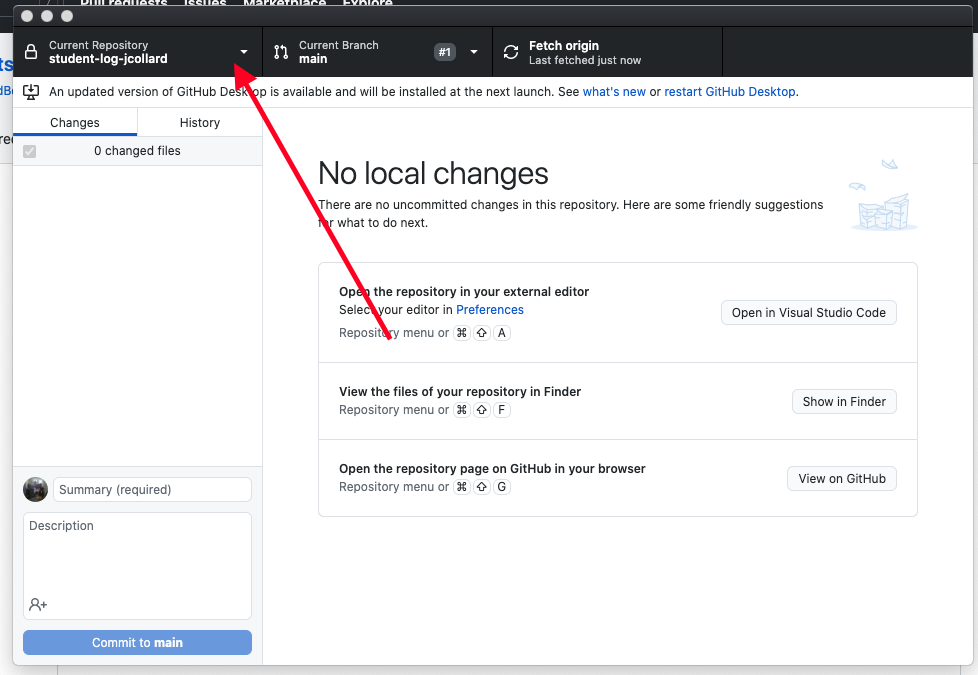

# AdventureQuest

A text based adventure engine.

* [Overview](#overview)
* [Getting Started](#getting-started)
    * [Sign up for the Project](#sign-up-for-the-project)
    * [Clone your Repository](#clone-your-repository)
    * [Play the Dragon's Lair](#play-the-dragons-lair)
    * [Setting up the Project](#setting-up-the-project)
        * [Installing Node Version Manager](#installing-node-version-manager)
        * [Initializing the Project](#initializing-the-project)
        * [Running the Project](#running-the-project)
* [Milestone 1](#milestone-1)
    * [Flow Charts: The Dragon's Lair](#flow-charts-the-dragons-lair)
    * [Identifying Code Segments](#identifying-code-segments)
* [Milestone 2](#milestone-2)
    * [Flaming Goat Adventure](#flaming-goat-adventure)
* [Milestone 3](#milestone-3)
    * [Design Document](#design-document)
* [Milestone 4](#milestone-4)
    * [Final Game](#final-game)
* [Grading](#grading)
    * [Computational Thinking](#computational-thinking)
    * [Computing, Programming, and
      Practice](#computing-programming-and-practice)
    * [Skills of a Programmer](#skills-of-a-programmer)
* [Getting Help](#getting-help)
* [Appendix A: Flow Chart Components](#appendix-a-flow-chart-components)
* [Appendix B: Keywords](#appendix-b-keywords)
* [Appendix C: README.md](#appendix-c-readmemd)
* [Appendix D: Creating an Adventure](#appendix-d-creating-a-room)


## Overview

You will design a text based adventure game and implement it in the Adventure
Quest Game Engine where it can be played by anyone in the world!

## Getting Started

### Sign up for the project

Sign up for the project here: TODO

### Clone your repository

After you have signed up for the project, you can clone it using Github Desktop.


1. Click the Current Repository drop down



2. Click `Add` > `Clone Repository`


3. Select the `GitHub.com` tab


4. Select the `adventure-quest-XXXXXX` respository and click clone. You may have
   to click the refresh icon next to `Filter your repositores` before it will be
   displayed.

5. Open the project in `Visual Studio Code`

### Play the Dragon's Lair

The Dragon's Lair is a text adventure created by Mx. Collard to demonstrate the
Adventure Quest Game Engine's API (Application Programming Interface).

TODO


### Setting up the project

#### Install Node Version Manager

##### Mac OS

The easiest way to install Node Version Manager is to first install Homebrew.
Homebrew is a package manager for Mac OS that makes it easy for users to install
librarys and software all in one place.

To install Homebrew:

1. Open a terminal. 
    * If you press (Command + Space) you will open Searchlight Finder.
    * Type "Terminal" and press enter
2. Run this command: 
    * `/bin/bash -c "$(curl -fsSL
      https://raw.githubusercontent.com/Homebrew/install/HEAD/install.sh)"`
3. Follow the on screen instruction. When you're prompted for a password, type
   the password you use to log into your computer. Installation may take some
   time.

After Homebrew is installed, you can install Node Version Manager by running the
following commands:

1. `brew update`
2. `brew install nvm`

To verify that Node Version Manager is installed, run the following command:

`nvm --version`

You should see something like:

`0.38.0`

##### Windows

To get Node Version Manager, download `nvm-setup.zip` from this page:
[LINK](https://github.com/coreybutler/nvm-windows/releases/tag/1.1.7)

Unzip the file and run the installer.

To verify that Node Version Manager is installed:

1. Open a Terminal
    * Press the Windows Key
    * Type `Git Bash` and press entedr
2. In the terminal window type `nvm version`

If it is installed, you should see something like:

`1.1.7`

#### Initializing the Project

Next, we will initialize the project, downloading all the necessary dependencies
and running it locally on your computer.

1. First, open your project in Visual Studio Code
2. Press (Command + Shift + P) to see the Command Pallette
3. Search for `Terminal: Select Default Profile`
    * On Mac, select `bash`
    * On Windows, Select `Git Bash`
4. Press (Command + Shift + P) to open the Command Pallette
5. Search for `Create New Terminal`
    * This will open a terminal at the bottom of Visual Studio Code, click into
      it.
6. Run the command `cd project`
    * The `cd` command stands for Change Directory, it will move the terminal to
      be in the `project` folder
7. Run the command `nvm install 16.9.1`
    * This command will download a program called Node which is used to run
      javascript
8. Run the command `nvm use 16.9.1`
    * This command tells your terminal to use this version of Node
9. Run the command `npm install`
    * This command will install all of the dependencies to run Adventure Quest.
      This command will take several minutes to run.

If all goes well, you're ready to run the project!

#### Running the Project

##### Angular

This project uses a framework called Angular.

Angular is a popular open-source web development platform developed and
maintained by Google. Angular provides a suite of tools to help build, test, and
update code. Angular is an industry standard and knowing it is a highly sought
skill. Angular uses the Typescript programming language.

##### Creating a Server

To create a server to run the project:

1. Open a Terminal (if you have not done so already)
    * (Command + Shift + P) -> `Create New Terminal`
2. Make sure you're in the project folder
    * `cd project`
3. Run the command `npx ng serve -o`
    * This command runs Angular, creates a debugging server on your computer,
      and opens your default web browser on the project which is running at
      `localhost:4200`.

## Milestone 1

* **E Period** - Wednesday, September 22nd @ 11:59PM
* **C Period** - Thursday, September 23rd @ 11:59PM

### Flow Charts

The Dragon's Lair adventure contains 7 rooms. For this milestone, you will study
the code for each of these rooms and translate their `handleInput` methods into
procedure flowcharts. 3 of the rooms have been complete for you. As you complete
each room, you should add its code and flowchart to the README.md file in the
`DragonsLair` folder. For more information on procedure flowcharts, see
[Appendex C: Procedure](#procedure)

#### Completed Rooms
1. [Cave Entrance](project/src/adventure/DragonsLair/rooms/CaveEntrance.ts)
    * [Flowchart](DragonsLair/README.md#cave-entrance)
2. [Lair](project/src/adventure/DragonsLair/rooms/Lair.ts)
    * [Flowchart](DragonsLair/README.md#lair)
3. [Tunnel](project/src/adventure/DragonsLair/rooms/Tunnel.ts)
    * [Flowchart](DragonsLair/README.md#tunnel)

#### Rooms to Complete
1. [Dead End](project/src/adventure/DragonsLair/rooms/DeadEnd.ts)
2. [Gym](project/src/adventure/DragonsLair/rooms/Gym.ts)
3. [Mouth of Cave](project/src/adventure/DragonsLair/rooms/MouthOfCave.ts)
4. [Snoring](project/src/adventure/DragonsLair/rooms/Snoring.ts)

### Milestone 1 Deliverables

To submit Milestone 1, you should complete the Flowcharts section of the
[DragonsLair/README.md](DragonsLair/README.md) document.

When you have completed the Flowcharts section, committed and pushed it, you
will create a tag called `milestone-1`. If you later decide you would like to
change the commit for `milestone-1` you may create additional tags with a
version number. For example, `milestone-1-v2` or `milestone-1-v3`. For final
grading, the `milestone-1` tag with the greatest version number will be used.
After creating your tag, don't forget to push it to Github and verify it is
available online.

## Milestone 2

* **E Period** - Tuesday, September 28th @ 11:59PM
* **C Period** - Wednesday, September 29th @ 11:59PM

### Flaming Goat Adventure

### Milestone 2 Deliverables

## Milestone 3

* **E Period** - Monday, October 4th @ 11:59PM
* **C Period** - Tuesday, October 5th @ 11:59PM

### Design Document

### Milestone 3 Deliverables

## Milestone 4

* **E Period** - Monday, October 11th @ 11:59PM
* **C Period** - Tuesday, October 12th @ 11:59PM

### Create a Text Adventure

### Milestone 3 Deliverables

## Grading

### Computational Thinking

In this assignment, you will demonstrate your understanding of flow charts,
sequencing, selection, and iteration.

| Advanced                                                                    | Proficient                                                                                                        | Basic                                                                                                         | Below Basic                                  |
|-----------------------------------------------------------------------------|-------------------------------------------------------------------------------------------------------------------|---------------------------------------------------------------------------------------------------------------|----------------------------------------------|
| Identifies at least 2 significant sequences, 2 selections, and 2 iterations | Identifies at least 5 components in their flow chart including at least 1 sequence, 1 selection, and 1 iteration. | Identifies the required sequencing, selection, and iteration sections of 5-2-1-1 in the provided source code. |                                              |
| Attempts to write "Fake Code" for at least 2 of their identified sections.  |                                                                                                                   |                                                                                                               |                                              |
|                                                                             | Completes a flow diagram for another game                                                                         | Completes a flow diagram for 5-2-1-1                                                                          | Does not complete a flow diagram for 5-2-1-1 |

### Computing, Programming, and Practice

It is important for other people to be able to understand and follow your work.
In this assignment, you will demonstrate your ability to commit your work to
your repository, write reasonable commit messages, and provide a REAME.md
document describing how your flow diagram relates to your chosen game's
instructions. 


| Advanced                                                                                                                   | Proficient                                                                                                                           | Basic                                                                         | Below Basic                                                  |
|----------------------------------------------------------------------------------------------------------------------------|--------------------------------------------------------------------------------------------------------------------------------------|-------------------------------------------------------------------------------|--------------------------------------------------------------|
|                                                                                                                            | Student created a tag for all milestones                                                                                             | Student tagged some of their milestones                                       | Student did not tag any of their milestones                  |
|                                                                                                                            | Student commits and pushes their flow diagram images to their repository.                                                            | Student commits and pushes a flow diagram  for 5-2-1-1 into their repository. | Student does not include a complete flow diagram for 5-2-1-1 |
| Student's README.md is properly formatted and contains images of their flow diagrams  embedded directly into the README.md | Student's README.md contains a formally  written explanation describing how their flow diagram meets the rules of their chosen game. | Student provides a README.md in their repository.                             | Student does not provide a README.md in their repository.    |
### Skills of a Programmer

Your skills of a programmer covers your Student Log repository, your in class
time management, meeting deadlines, asking for help when needed, and helping
others when able.

| Advanced                                                                                                                  | Proficient                                                                                                                                                | Basic                                                                                                                                   | Below Basic                                                                                         |
|---------------------------------------------------------------------------------------------------------------------------|-----------------------------------------------------------------------------------------------------------------------------------------------------------|-----------------------------------------------------------------------------------------------------------------------------------------|-----------------------------------------------------------------------------------------------------|
| Manages time well in class,  stays focused on work at hand at almost all times                                            | Focuses on work in class                                                                                                                                  | Focuses at times, can get distracted                                                                                                    | Uses class time poorly, is frequently distracted                                                    |
| Meets all deadlines, ahead of schedule by at least 4 hours.                                                               | Meets deadlines or asks for an extension at least 48 hours ahead of time.                                                                                 | Delivers close to deadline, may be late  by a day or two                                                                                | Delivers work late or not at all                                                                    |
| Participated on Piazza by asking a question, answering a question, or creating a helpful note for other students.         | Seeks assistance when needed                                                                                                                              | Needs prompting to seek assistance                                                                                                      | Does not seek assistance or ask for help when needed                                                |
| Almost all log entries are pushed after creating them.                                                                    | Almost all log entries provide a consistent commit timestamp relative to the date mentioned in the entry. All log entries are pushed prior to milestones. | Log entries follow the proper  sign-on and sign-off format.                                                                             | Few or no log entries follow the proper sign-on and sign-off format.                                |
| Student creates a sign-on and sign-off log entry  every class and between each block period. Only missing 1 or 2 entries. | Student creates a sign-on and sign-off log entry  almost every class and between each block period. Only missing 1 or 2 entries.                          | Student creates a sign-on and sign-off log entry most classes and almost always between each block period. Only missing 3 or 4 entries. | Student frequently misses creating a sign-on and sign-off log entry. Missing 5 or more log entries. |

## Getting Help

All questions should be posted to the class Piazza Q&A. You are also encouraged
to help other students who post on Piazza. When you post your question, be sure
to include as many details as possible for reproducing the issue you're having.

Questions you should answer when asking a question include:

1. What are you trying to do?
2. What did you try?
3. What was the result?

Work hard to make sure the person trying to answer your question can reproduce
your error. Share your files so others can run exactly what you're running.

Also, include screenshot / pictures if applicable.

Formulating good questions is a good life long skill. You should try asking your
question on Piazza before seeking out synchronous time with Mx. Collard.
However, if you would like to meet to discuss synchronously, first, look at [Mx.
Collard's Calendar](http://tinyurl.com/collard-calendar), then send them an
email with at least two proposed times you would like to meet.


## Appendix A: Flow Chart Components

### Entry Point


An entry point serves as a label for the start of a flow chart. An entry point
should have no incomming arrows and should contain exactly one outgoing arrow.
It is denoted as a box with round corners.

### Procedure


A procedure is a special type of entry point. A procedure may have zero or Data
arguments specified by incomming arrows. A procedure must have exactly one
outgoing arrow. A procedure is denoted by a box with two vertical lines near the
ends. The name of the procedure is written inside the box followed by the order
of the arguments.

A procedure is a special type of Entry Point which is expected to reach a
Terminal. Upon reaching a Terminal, a procedure will return to the point in the
flowchart from which it was called. Typically (but not always), the procedure
will return Data which can be used by the calling Process. If a procedure has a
path that does not reach a Terminal, it is considered malformed.

#### Calling a Procedure

Calling a procedure is typically done as part of a Process.


The example above calls the `sum` procedure and specifies the parameters `(5,
7)`. This sets the argument `x` to be the value `5` and the argument `y` to be
the value `7` during the call of the procedure. If you follow the `sum`
procedure from above, it will perform addition on `x` and `y` storing it into a
variable `result`. Finally, upon reaching the `Terminal` it returns the value
stored in `result`, in this case `12`. When the procedure `returns` the value
`12` is substituted in place of `sum(5,7)` resulting in the assignment `z = 12`.

### Process


A process describes an action that is taken. A process must have at least one
(but may have more) incomming arrow and exactly 1 outgoing arrow.

### Display


A display block is a type of process which describes an output that is displayed
to the user. The output can be just about anything but in most flow charts it
contains text, an image, or text describing an image. Just like a process, a
display must have at least one incomming arrow and exactly 1 outgoing arrow.

### User Input


A user input block is a type of process which waits for input from a user.
Typically it contains a message such as `Read from X then assign result to Y`
where `X` is an input device such as `keyboard`, `mouse`, or `microphone` and
`Y` is the name of a variable. However, it is possible to ignore the input. This
might be written as `Read from keyboard then ignore the result`. This is useful
if you want the user to press enter, or click a continue button.

### Data


A data block is a type of Process block which specifies that space should be
allocated to store computer data. A data block contains two lines, a Type and a
name. The Type specifies the type of data that will be stored and the name
specifies the variable name to be used to refer to the stored data.

Typically, a data block must have one or more incomming arrows and exactly one
outgoing arrow. However, if the data block's outgoing arrow is pointed to a
Procedure, the data block should have no incomming arrows. In this case, the
data is expected to be passed to the procedure from the calling process.

#### Accessing Data

A data variable may only be used in a block in which the variable has previously
been declared using a data block. If a block has access to a variable, the
variable is said to be `in scope`. Similarly, if a block does **not** have
access to a variable, the variable is said to be `out of scope`.

### Decision


A decision block describes a branching path in a flow chart that is based on a
yes or no condition. A decision must have at least one (but may have more)
incomming arrow and must contain exactly two outgoing arrows: one for the yes
condition and one for the no condition.

### Connector


A connector block indicates that the flow chart should continue from another
Entry Point, typically on a different page. A connector must have at least one
(but may have more) incomming arrow and no outgoing arrows.

### Terminal


A terminal block indicates the end of the sequence. Similar to the Entry Point,
a terminal block is represented by a box with rounded corners. However, a
terminal does not have any outgoing arrows. It must have at least one incomming
arrow and may have multiple incomming arrows.


## Appendix B: Keywords

### Sequence
Sequencing is the sequential exeution of operations. A **significant** sequence
is a sequence in which the order of operations is important to the result of the
sequence.

Below is an example of an insignificant sequence: 


The sequence above is insignificant because the order in which the operations
are executed is not important. If you swapped the order, the end result would be
the same.

Below is an example of a significant sequence: 


The sequence above is significant because the order in which the operations are
executed is important. If we were to swap the shuffle operation with the discard
operation, the end result would be that we always remove the same 10 cards. If
we were to swap the shuffle operation with the draw operation, the players would
always draw the same cards.

### Selection

Selection is the decision to execute one operation versus another operation
(like a fork in the road).

Below is an example of a selection:


In the above example, a selection is made on the condition "Is the deck empty?".
If the deck is empty, the players sum their scored cards. Otherwise, the players
play another round.


### Iteration

Iteration is repeating the same operations a certain number of times or until
something is true.

Below is an example of iteration:


In the above example, players will continue to draw cards until each player has
exactly 5 cards. 

## Appendix C: README.md

It is a relatively standard protocol to have README.md files at the base
directory of important folders. On Github (and other sites), when you navigate
to a folder, if a README.md file is present, it is displayed as a website to the
user. In fact, the instructions for this project are contained in the README.md
file in the root of this project. In Visual Studio Code, you can actually view a
formatted version of a Markdown file by right clicking on it in the file browser
and selecting `Open Preview`.


This is a great way to see what your resulting README.md file will look like and
help you catch any formatting errors you might have.

### Headers

In Markdown, headers are denoted using one or more octothorpes (`#`) followed by
the text you would like for the header. The more octothorpes you use, the
smaller the header will be. For example:

```
# Header 1
## Header 2
### Header 3
```

Results in the following:

# Header 1
## Header 2
### Header 3

Use headers to create different sections in your Markdown files.

### Code Boxes

Sometimes you want to be able to provide preformatted code with syntax
highlighting. To do this, you surround the code in three backticks: (```) For
example:


Produces the following:

```
    while (true) {
            if (state.deck.isEmpty() == false) {
                while (state.getHandSize() < 5) {
                    state.playerDrawCard();
                }
            }

            if (state.countCardsInPlay() == 4) {
                break;
            }
            state.playersPlayCard();
            state.flipUpCards();
        }
```

Notice, there is no syntax highlighting. To ask for syntax highlighting, you can
add the language to highlight at the end of the three backticks: (```typescript)
For example:


Produces the following:

```typescript
    while (true) {
            if (state.deck.isEmpty() == false) {
                while (state.getHandSize() < 5) {
                    state.playerDrawCard();
                }
            }

            if (state.countCardsInPlay() == 4) {
                break;
            }
            state.playersPlayCard();
            state.flipUpCards();
        }
```

### Images

Often times you will need to include images in your Markdown documents. To do
this you must first place an image file in your repository. Then, you create a
reference to it using the following syntax: ``.

For example, there is an image named `connector.png` located in the `support`
folder of this project. To reference the image you could write: ``

This would produce the following:


**Note**: The text between the square brackets (`[]`) is what is displayed if
the image cannot be found or if the person accessing the document is seeing
impaired. 